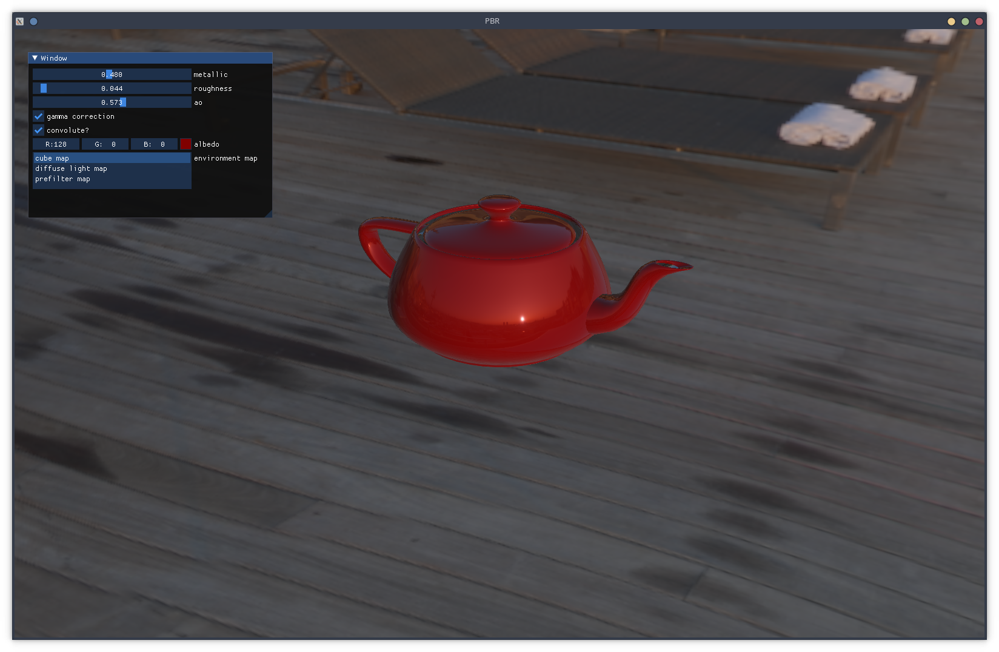
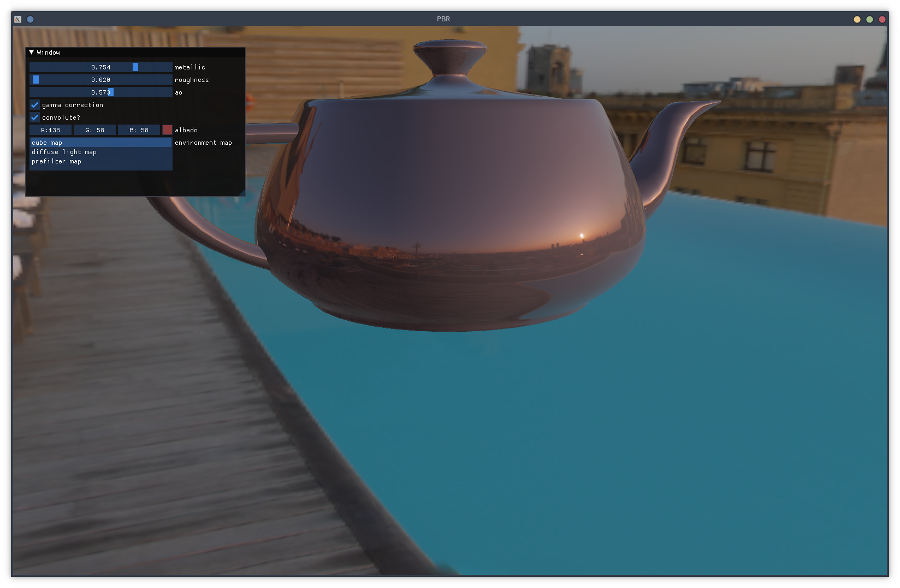
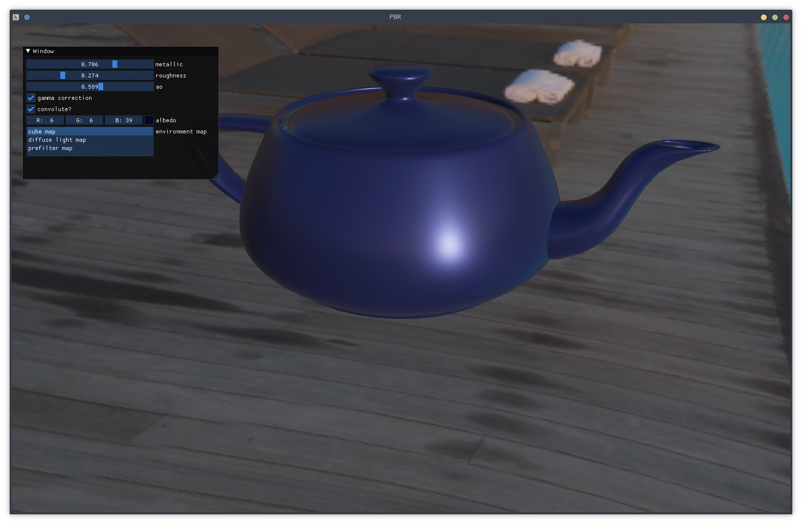
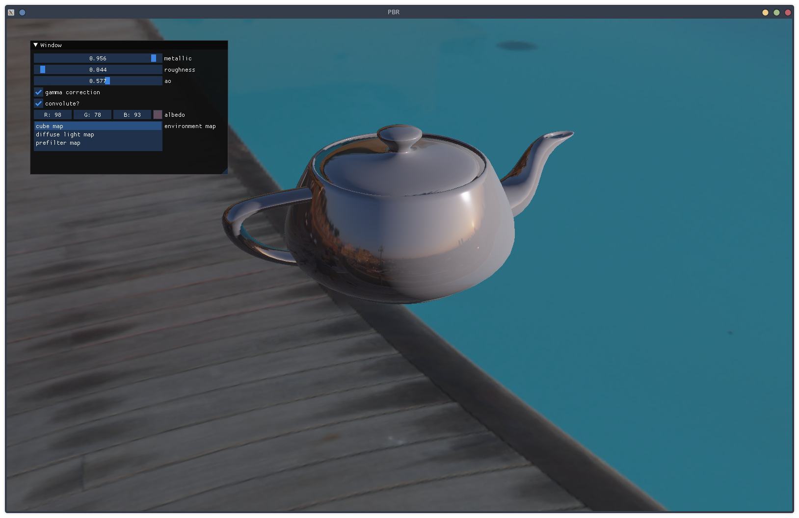
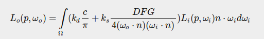
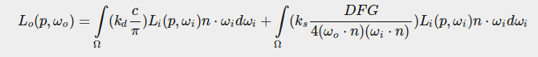
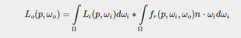
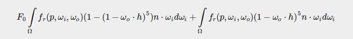

# PBR OpenGL project
 
## Description

Final project for class cs6610 (interactive computer graphics) following [pbr guide](https://learnopengl.com/PBR/Theory). 

## Implementation

This is physical based rendering used in production level (Unreal engine). PBR solves the rendering equation in an interesting way. It has used much more physical accurate model taking into consideration of energy conservation, material roughness, material dialectric, and more. For indirect lighing (global illumination) , I have used IBL (imaged based lighting) to simulate global illumination. 

For microfacet material model shading, more specifically the specular BRDF using

- D (Normal distribution function): Trowbridge-Reitz GGX
- F (Fresnel function): Schlick-GGX
- G (Geometric function): Schlick

For IBL, I implemented the epic game solution to both diffuse (irradiance map) and specular(split sum - prefilter and brdf) map. 

## Demo









## Thoughts

Instead of talking about PBR thoery, I am going to talk about my own thoughts on learning PBR. (There are numerous tutorial online to exposing the details of the PBR, it is not worth for me to repeat the same information here again.) 

- **Microfacet model**

Note: refracted light scatters in dialetric material. refraced light doesn't scatter in metallic material. 

This is the most fundamental thoery that governs the shading (Both direct and indirect illumination). Compare to simple blinn-phong shading model, the microfacet model intend to take microscopic level of the surfaces into consideration. The artist can interact with the shading with `roughness` and `metalness` parameter to modify diffuse and specular of the surface. Intuitively, `roughness` describes, in microscopic level, how rough the surface is. `metalness` describe the `reflectivity` of surface, in other terms, how much refracted light scatters. Those parameters are brilliant because it simply a lot of physics to the Users. 

How do we achieve the above ? Mathematically, the important modification here is the `brdf` function within the rendering equation, which result in the rendering equation for PBR as the following



This `brdf` is called `cook-torrance brdf`. I am not going to dive deep into this `brdf`, but it does follows energy conservation principle. The really interesting part of the this brdf is the specular part, which is how PBR can successfully integerate the `roughness` and `metalness` parameters into rendering. The three functions `D`, `F`, `G` can be chosen in such ways that gives realistic look for material surface depending on those parameters. More specically

- D appximates how much normals are aligned with microfacet vector (What percentage of the Normal and Half-way vector we want to use ?)
- G appximates how much microfacet surfaces can be seen (What percentage of microfacet surfaces are occluded ?)
- F appximates how much reflection should we see ? (What percentage of light gets reflected ?)

I am not going to give you the mathematical details as you can refer to it in articles in the credit and reference section. However, intuitively, we can see that `roughness` is related to `D` and `G` and `F`, and `metalness` is related to `F`. Indeed, incorporate those parameters into the rendering equation really just involves around those three functions. In context of direct lighting, using the the above shading equation can render out objects that are much more photorealistic. 

- **IBL**

You can't have photorealism without indirect lighting (Global illumation). However, computing indirect lighing is very expensive in context of interactive computer graphics. In PBR, Image-based lighting is used to approximate indirect lighting. The basic idea is to use environment maps to precompute lighing information and store the information into textures. Those textures later can be used to quickly accessed by look ups rather than computing indirect lighing on the fly. How do we achieve this ? we must go back to our rendering equation.


In order to achieve the fast time rendering, we must split the equation into diffuse and specular part



For diffuse part, by fixing p at the world origin, we can compute indirect
lighting by treating all pixels of the environment as lights. Since the
equation doesn't depend on the `view` vector. This is called irradiance cube
map. 

For specular part, it gets a bit tricky because now the equation also depends on
the view vector. That means that we have to recompute the map whenever we
change our camera direction. There are two appoaches: first approach is simply use
two-pass algorithm (this is expensive). The second approach is to approximate
the specular equation with product of two equation which none of them depends
on view vector directly. 



This is method is called **split-sum approximation** that came up by epic.

In this implementation, I used the later approach. The first part of the
split-sum equation is easy to do since it is similart to the diffuse part
except that we now take `roughness` into consideration. We can do this by having
mipmaps of textures that corresponding to `roughness` level. This is commonly
refered as `prefilter map`.

The second approximation is the most tricky and brilliant part of the split-sum. By
playing around with the second part of the split-sum, we can get this 



If we look carefully, we can see that this equation can be only dependent upon
`n dot v` and `roughness`. More importantly, both parameters are in the range
`[0 - 1]`. We can store the result into a 2D texture map that can be looked up
by this parameter. This map is commonly refered as `BRDF LUT` (Look up
texture). However, if you were like me, you would question, how would we
compute such map by taking `n dot v` ? The interesting intuition behind this is
that we can get 2d version of `v` through `n dot v`,where `v.x = sqrt(1 - pow(n dot v,2))` and `v.y = n dot v` with `n = vec3(0.0, 1.0, 0.0)` so what we really are computing here is all 90 degree angle of view direction on a 2d plane.

- **Monte Carlos Integeration**

In IBL, I have talked a lot about high level details of how we can approximate
global illumination by pre-compute different maps. All those computatoin are
solving the rendering equation, which is just a integral. We can't analytical
solve them integrals always but we can approximate them with Monte carlos 
integeration, which is a statistical approach in computing integrals. I am not
going to write upon this topic because it is very math heavy and can't be done
in just few sentences. However, here are a list of resources I recommond to
read if you really want to understand the details of IBL. 

[pixels](https://www.scratchapixel.com/)
[learnOpenGl](https://learnopengl.com/PBR/IBL/Specular-IBL)

- **Gamma correction**

Gamma correction is a simple, yet important thing to do in a PBR. You can do gamma correction one line in the shader `color = pow(color, 1/gammafactor)`. The reason why we want to do gamma correction is that how human perceive brightness of the coolor is non-linear in contrast to the physical brightness that is linear. Our monitor uses the non-linear brighness scale that matches human perception of the brightness. However, whenever we do math on color, we are doing it in a linear physical scale. Evenetually, the color (when get to monitor) will be `color = pow(color, 2.2)`. So in order to make amend by this, we need to do the reverse to cancel out the `gammafactor`. 

- **HDR** 

High Dynamic Range is the ability that storing `rgb color` beyond the range of `[0-1]`. In PBR, we must work with `light intensity` (light color), which can be much more higher that `[0-1]`. This is important in PBR because, for example, it might make sense for the sun to have much more `light intensity` than a light bulb. The problem is that our output color in fragment shader must be in range `[0-1]` ( you can output other color, but it will get clamped into that range), so we need to a `normalization scheme`. This is where HDR algorithm comes in handy. The simplest one we use is the reindeer tone mapping algorithm `color = color / (color + vec3(1.0));`. 

## External Dependencies

1. GLEW
2. GLFW
3. CyCodeBase
4. IMGUI

## Build 

I provide a Makefile. If you are using windows, make sure you have **wsl2** and **mingw64** installed (See below for how to install mingw64). If are on other system, modify the **Makefile** accordingly (see Makefile). Once you have all dependencies, call `make all` and find executable under `./build/App.exe`

### How to install mingw64 for OpenGL application

1. Obtain an installer from [msys2](https://www.msys2.org/).
2. Follow the installer or the website to finish the installation.
3. After installation, ensure you open `mingw64.exe` in folder `msys64/mingw64.exe`  *(Note: msys2 shell is prompted immediately after installation, make sure you DON’T use msys2. Instead, open mingw64.exe in msys64/ folder.)*
4. Put following command into the terminal:
```
$pacman -Syu 
$pacman -Su 
$pacman -S --needed base-devel mingw-w64-x86_64-toolchain 
$pacman -S mingw-w64-x86_64-glew 
$pacman -S mingw-w64-x86_64-glfw
```

### Toubleshoot for Makefile

Check following variables in `Makefile` if you can't build the application
```
GPP = <path to g++>
LINK = <libraries>
EXE = <output executable>
FLAGS = -I./include <add your own flags>
```
An example of the Makefile configuration on `wsl2`with `mingw64`.
```
GPP = /mnt/c/msys64/mingw64/bin/g++.exe
LINK = -lglfw3 -lglew32 -lopengl32 -lgdi32 -limm32
EXE = ./build/App.exe
FLAGS = -g -Wall -I./include
```
Another example for linux system (I did on arch)
```
GPP = g++
LINK = -lglfw -lGLEW -lGL
EXE = ./build/App
FLAGS = -g -Wall -I./include
```
For windows, if you want to build this in powershell, you need to get gnu make and change file paths, and other things accordingly. Recommond you to install `wsl2` (most distro will be fine), so you can launch `bash` in your windows terminal. 

If `./build/**.cpp file not found` occurs, you might want to make sure you have a `./build` directory set up.

## Credit and Reference

1. [Joey de Varis](https://learnopengl.com/PBR/Theory)
2. [Brain Karis - Epic game](https://blog.selfshadow.com/publications/s2013-shading-course/karis/s2013_pbs_epic_notes_v2.pdf)
3. [Naty Hoffman](https://blog.selfshadow.com/publications/s2013-shading-course/hoffman/s2013_pbs_physics_math_notes.pdf)


Special thanks to my professor: Cem Yuksel 

Special thanks to the author of LearnOpengl: Joey de Varis

Author : Jerry Zhang
